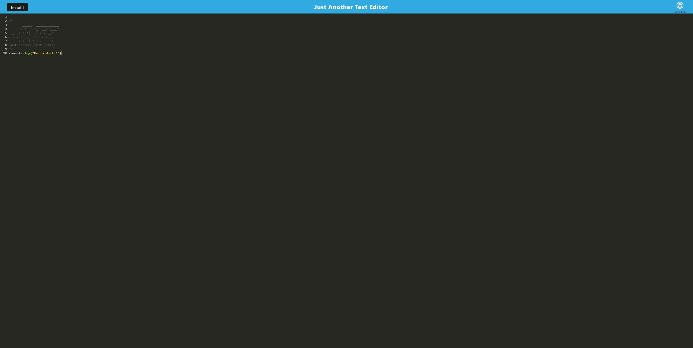
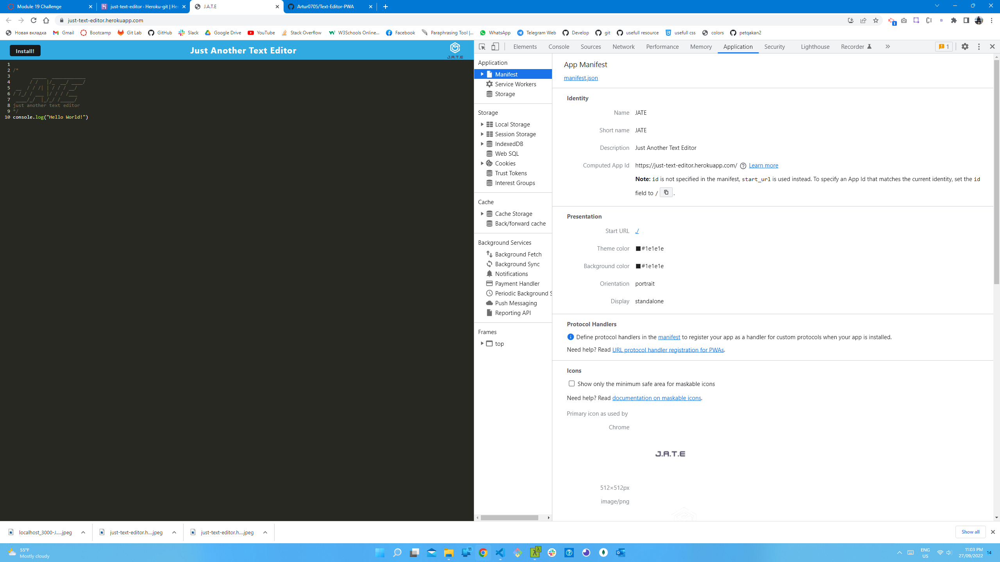
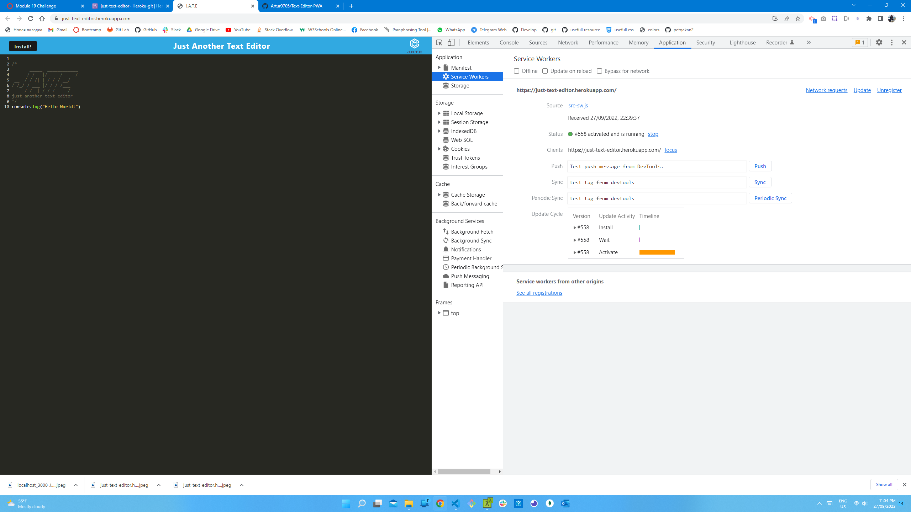
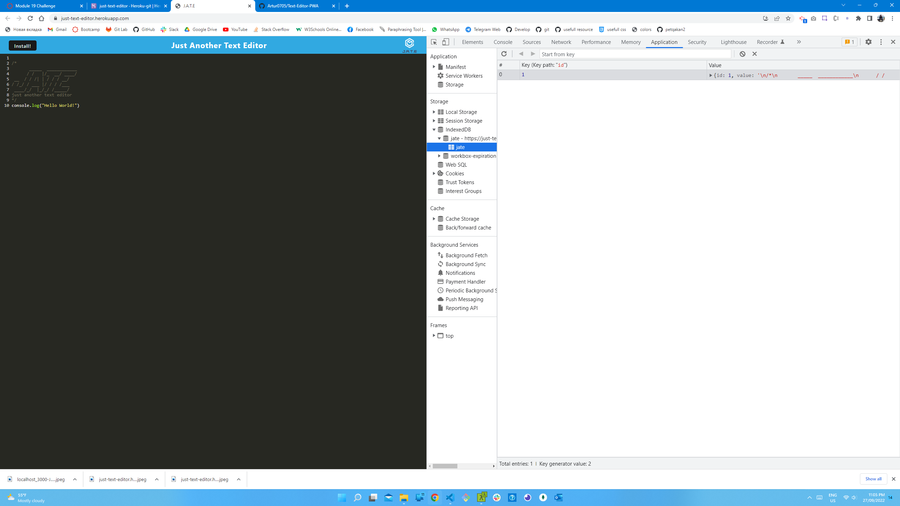

# Text Editor 

  ## Description
  - An installable `PWA` text editor which works without an internet connection
  - This application implement methods for getting and storing data to an `IndexedDB` database.

  ## Table of Contents
  * [Installation](#installation)
  * [Usage](#usage)
  * [License](#license)
  * [Contributing](#contributing)
  * [Tests](#tests)
  * [Demo](#demo)
  * [Screenshot](#screenshot)
  * [Questions](#questions)

  ## Installation

  - Clone repository to use this application on local machine.
  - `Node.js` is required.
  - Install necessary dependencies by running `npm install`
  - To start the application run `npm run start`

  ## Usage
  - The application allows users to use text editor with or without internet and ability to install in their local machines.

  ## License
  This project is licensed under 

  ## Contributing
  - N/A

  ## Tests
  - N/A

  ## Demo

  - Please follow this [link](https://just-text-editor.herokuapp.com) to visit the deployed application on Heroku.
  

  ## Screenshot 
  - Please see the screenshots below for `Main page`, `Manifest.json`, `Service worker` and `IndexDB`

  
  
  
  

  ## Questions
  If you have any questions regarding the project you can contact me directly at artlil420@gmail.com.
  Please feel free to view more of my projects at https://github.com/Artur0705